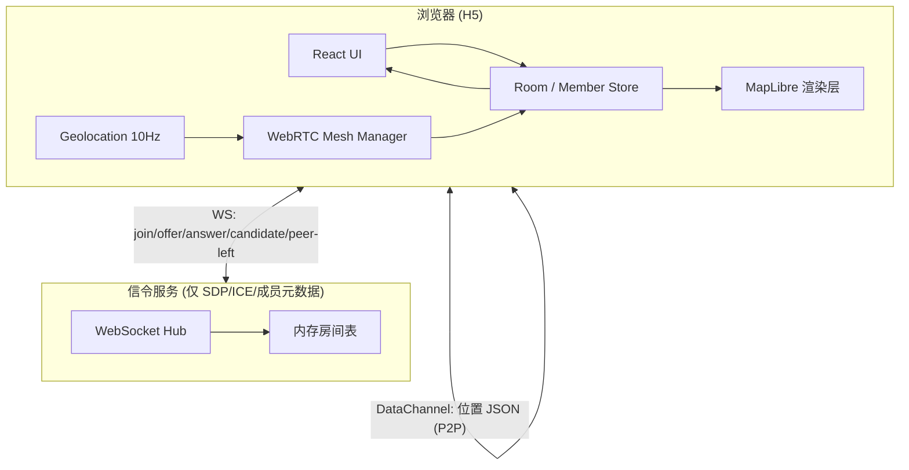
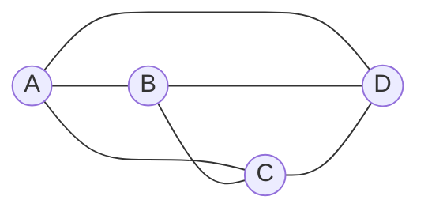
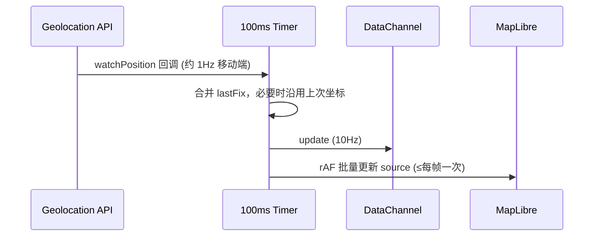
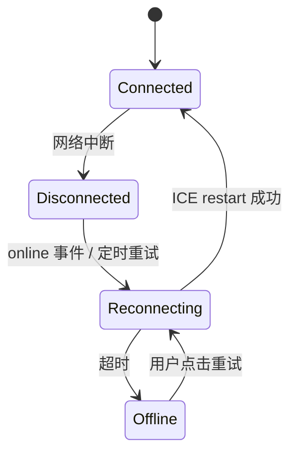

# LocateRoom Lite — 技术设计

> 基于 [需求说明](./REQUIREMENTS.md) 与 [验收清单](./ACCEPTANCE.md) 整理。实现时以本文为准，README 中摘录架构与取舍摘要。

## 1. 需求分析

### 1.1 硬性约束

| 维度 | 约束 | 设计影响 |
|------|------|----------|
| 传输路径 | 位置数据 **必须** 走 WebRTC DataChannel P2P | 需信令 + ICE；禁止用 WS/HTTP 转发坐标 |
| 规模 | 最多 **4 人** / 房间 | 可采用 **Full Mesh**，无需 SFU/MCU |
| 频率 | **10 Hz** 位置上报 | 定时器 + 节流；GPS 低频时需插值/复用 |
| 渲染 | 地图 **≥ 50 fps** | 标记更新与 React 渲染解耦 |
| 首连 | 入房后 **≤ 3s** 看到他人位置 | 并行信令 + ICE；入连即推 snapshot |
| 端 | H5，中端 Android + iOS Safari | HTTPS、权限引导、WebRTC 兼容策略 |

### 1.2 稳定性诉求（隐含非功能需求）

- **状态同步**：新成员入房需拿到全员 **最新** 位置（非等下一轮 100ms 广播）。
- **可恢复**：短暂断网后 ICE/信令重连，恢复 DataChannel。
- **可观测**：成员上下线对 UI 可见（列表 + 地图状态）。

### 1.3 不在 MVP 范围（加分项）

语音对讲、轨迹、弱网降级、移动端深度优化——文档预留扩展点，**4–6h** 内不阻塞主路径。

---

## 2. 技术选型

### 2.1 已选栈（沿用仓库脚手架）

| 层级 | 选型 | 理由 |
|------|------|------|
| 框架 | **React 19** + **TanStack Router / Start** | 已有脚手架；文件路由适合 `/room/$roomId` |
| 构建 | **Vite 8** | 快 HMR，利于短周期迭代 |
| 样式 | **Tailwind CSS 4** + shadcn 组件 | 快速搭 UI，移动端适配成本低 |
| 质量 | **Biome** + **Vitest** | 格式化/ lint 一体；关键逻辑可单测 |

### 2.2 拟引入依赖

| 能力 | 选型 | 备选（未选原因） |
|------|------|------------------|
| 地图 | **MapLibre GL JS** | Leaflet：DOM 标记多时帧率难稳；Google Maps：需 key、成本高 |
| WebRTC 封装 | **自研薄封装**（`RTCPeerConnection` + DataChannel） | simple-peer：抽象够用但少控 ICE 重启；mediasoup：过重，偏 SFU |
| 信令 | **独立 WebSocket 服务**（Bun + `ws` 或 Hono WS） | PeerJS 公共信令：不稳定；Firebase：引入后端厂商；纯 HTTP 轮询：延迟高 |
| 客户端状态 | **Zustand**（或轻量 Context） | Redux：样板多；Jotai：亦可，房间状态树不复杂 |
| 房间 ID | **UUID v4**（URL 路径） | 短码：碰撞与枚举风险需额外处理 |
| STUN | 公共 STUN（如 `stun:stun.l.google.com:19302`） | — |
| TURN | **可选**（Metered / Cloudflare 试用） | 无 TURN 时对称 NAT 下 P2P 可能失败；README 说明限制与自测环境 |

### 2.3 部署选型（建议）

| 组件 | 建议 | 说明 |
|------|------|------|
| 前端 | **Vercel** | [locate-room-lite.vercel.app](https://locate-room-lite.vercel.app/)（TanStack Start + Nitro SSR） |
| 信令 | **Railway** | [locate-room-lite-production.up.railway.app](https://locate-room-lite-production.up.railway.app) · `VITE_SIGNAL_URL=wss://locate-room-lite-production.up.railway.app/signal` |
| 环境 | **必须 HTTPS** | 浏览器 `getUserMedia` / 精确定位与 WebRTC 在移动端要求安全上下文 |

---

## 3. 总体架构

### 3.1 逻辑分层



**原则**：信令服务器 **不转发** `lat/lng`；仅交换 WebRTC 握手与房间成员事件。

### 3.2 网络拓扑：4 人 Full Mesh

4 人房间时，每人最多 **3 条** PeerConnection，全网 **6 条** 无向链路（C(4,2)）。



| 方案 | 4 人适用性 | 结论 |
|------|------------|------|
| Full Mesh | 链路少、实现快、符合 P2P 题意 | **采用** |
| SFU (mediasoup 等) | 扩展性好，需媒体服务器 | 超纲，放弃 |
| Star（一人中继） | 非标准 P2P，单点故障 | 放弃 |

### 3.3 路由与页面

| 路径 | 职责 |
|------|------|
| `/` | 创建房间 → 生成 `roomId` → 跳转 |
| `/room/$roomId` | 加入房间、地图、成员列表、分享链接 |
| （可选）`/join?room=` | 兼容 query 形式分享链接 |

---

## 4. 核心方案

### 4.1 信令协议（WebSocket）

**连接**：`wss://<host>/signal?roomId=&peerId=&displayName=`

**客户端 → 服务端**

| type | 字段 | 说明 |
|------|------|------|
| `join` | `roomId`, `peerId`, `meta` | 进入房间；服务端返回当前成员列表 |
| `signal` | `to`, `payload` | 转发 SDP / ICE（`offer` \| `answer` \| `ice-candidate`） |
| `leave` | — | 主动离开 |

**服务端 → 客户端**

| type | 说明 |
|------|------|
| `joined` | 新成员 `peerId` + `meta`（触发既有 peer 与其建连） |
| `left` | 成员离开（更新 UI，关闭对应 PC） |
| `signal` | 转发的 WebRTC 信令 |
| `room-state` | 入房时全量成员列表 |

**房间状态**：服务端内存 `Map<roomId, Set<peerId>>`，无持久化；符合「小房间」场景。

### 4.2 WebRTC 连接策略

1. **角色**：`peerId` 字典序小者为 **Polite Peer**（冲突时回滚 glare），避免 offer/answer 竞态。
2. **每条链路**：一个 `RTCPeerConnection` + 一个 **unordered**、**maxRetransmits: 0** 的 DataChannel（`location`），优先低延迟。
3. **ICE**：`iceServers: [{ urls: stun }, ...可选 turn]`；`iceConnectionState` / `connectionState` 驱动 UI 在线状态。
4. **入房顺序**：
   - 收到 `joined`（他人）→ 若我方 id 较小则 `createOffer`，否则等待对方 offer。
   - `datachannel` open → 发送 `snapshot`（见下）。

### 4.3 DataChannel 消息协议

统一 JSON，单行便于调试：

```ts
type LocationPayload = {
  lat: number
  lng: number
  accuracy?: number
  heading?: number
  speed?: number
  ts: number // Date.now()
}

type Message =
  | { t: 'snapshot'; peerId: string; loc: LocationPayload }
  | { t: 'update'; peerId: string; loc: LocationPayload }
  | { t: 'ping'; ts: number }
  | { t: 'pong'; ts: number }
```

| 消息 | 时机 |
|------|------|
| `snapshot` | Channel 首次 open；新 join 方立即收到各方最新点 |
| `update` | 本地 10 Hz 采样后广播给所有已连接 peer |
| `ping` / `pong` | 可选；辅助判断链路 RTT（加分项弱网可用） |

**新成员「立即可见」**：每个已有 peer 在 channel open 时发 `snapshot`；新 peer 合并为本地 `peers[peerId].location`。

### 4.4 地理位置 10 Hz



| 要点 | 说明 |
|------|------|
| 采集 | `navigator.geolocation.watchPosition`，`enableHighAccuracy: true`，`maximumAge: 0` |
| 10 Hz | `setInterval(100)` 与 watch 解耦；无新 fix 时 **重复发送上次有效点**（README 标明与真 GPS 10Hz 差异） |
| 权限 | 首次进入 `/room` 引导授权；拒绝时展示说明，不阻塞房间逻辑（可用模拟坐标自测） |

### 4.5 地图渲染 ≥ 50 fps

**避免**：每个 `update` 触发 React `setState` 重绘 Map。

**推荐**：

1. MapLibre **GeoJSON Source** `peers`，`PromoteId: 'peerId'`。
2. 位置变更写入 **mutable store**（Zustand / ref），在 **`requestAnimationFrame`** 中合并本帧所有 peer 变更，调用 `source.setData()` **每帧最多一次**。
3. 标记用 **Symbol / Circle layer**，不用 HTML Marker。
4. 本地位置：独立 layer 高亮，减少整表 `setData` 字段（仅改一个 feature 亦可）。

### 4.6 成员与掉线感知

| 事件源 | UI 行为 |
|--------|---------|
| 信令 `joined` / `left` | 成员列表增删；Toast「xxx 加入/离开」 |
| `iceConnectionState === disconnected` 持续 > N 秒 | 标记为「重连中」 |
| `failed` / `closed` | 标记离线；从地图淡化或灰显 |
| 信令 `left` | 移除 marker，关闭 PC |

**重连**：`disconnected` → `restartIce()` + 重新 `offer/answer`；信令层 `peerId` 不变；指数退避 1s / 2s / 4s（上限 30s）。

### 4.7 断网恢复



1. `window.addEventListener('online')` 触发信令 WS 重连。
2. WS 恢复后服务端下发 `room-state`，客户端对缺失链路重新协商。
3. 各 channel 再次 open 后互发 `snapshot`，快速恢复地图。

---

## 5. 模块划分（前端）

```
src/
  routes/
    index.tsx              # 创建房间
    room/$roomId.tsx       # 主界面
  features/
    room/
      useRoom.ts           # 房间 URL、分享
      memberStore.ts       # 成员与状态
    webrtc/
      PeerConnectionPool.ts
      SignalingClient.ts
      protocol.ts
    location/
      useGeolocation.ts    # watch + 10Hz tick
    map/
      MapView.tsx
      usePeerSource.ts     # rAF + setData
  server/                  # 若信令合入 TanStack Start
    signal-ws.ts
```

信令也可放在仓库根目录 `packages/signal/` 或 `server/`，与前端分开部署。

---

## 6. 性能与验收对齐

| 指标 | 目标 | 测量方法（写入 README） |
|------|------|-------------------------|
| 10 Hz | 发送侧计数 | `performance.now()` 统计 10s 内 `update` 发送次数 / 10 |
| 50 fps | 渲染侧 | Chrome Performance / `stats.js` 叠加；或 `requestAnimationFrame` 计数 |
| 首屏 ≤ 3s | 入房 → 首个他人 marker | `performance.mark`：`join-click` → `first-remote-location` |
| 4 人 | 联调 | 4 浏览器 tab / 3 真机 + 1 桌面 |

**优化清单（MVP）**

- DataChannel 二进制（`Float32Array` 打包 lat/lng/ts）——报文更小，可选。
- `update` 合并：100ms 内仅发 delta 超过 ~2m 的位移（弱网加分项）。
- 移动端减少 `setData` 属性字段，仅更新 coordinates。

---

## 7. 安全与边界

| 项 | 处理 |
|----|------|
| 房间链接 | 长 UUID，无房间列表接口 |
| 信令鉴权 | MVP 无登录；可加 room 内随机 `pin`（非必须） |
| XSS | 成员昵称转义展示 |
| HTTPS | 生产强制 |
| 隐私 | README 说明位置仅在 P2P 间传输、不落库 |

---

## 8. 取舍说明（评审重点）

| 决策 | 选择 | 放弃 | 原因 |
|------|------|------|------|
| 拓扑 | 4 人 Mesh | SFU | 规模小、题意 P2P、实现时间紧 |
| 信令 | 自建 WS | 第三方 Peer 云 | 可控、易演示、无外部依赖风险 |
| 地图 | MapLibre | Leaflet DOM | 帧率底线 |
| 状态 | Zustand + ref 驱动地图 | 全 React 状态驱动地图 | 避免 10Hz 触发重渲染 |
| TURN | 可选配置 | 必建 TURN 集群 | 成本与时间；文档说明 NAT 限制 |
| 持久化 | 无服务端 DB | Redis 房间 | 会话型应用，48h 交付足够 |

---

## 9. 实施阶段（建议 4–6h）

| 阶段 | 时间 | 产出 |
|------|------|------|
| P0 | ~1h | 信令 WS + join/left/signal 转发；`/room/$id` 骨架 |
| P1 | ~1.5h | 2 人 Mesh + DataChannel `update` / `snapshot` |
| P2 | ~1h | MapLibre + rAF 更新 + 成员列表 |
| P3 | ~1h | 4 人、ICE 重启、掉线 UI |
| P4 | ~0.5h | 10Hz 定时、性能 mark、移动端试机 |
| P5 | ~1h | README（架构图、测量表、AI 协作说明）、部署 |

---

## 10. 加分项实现

| 功能 | 状态 | 实现要点 |
|------|------|----------|
| 性能监控面板 | ✅ | `src/features/perf/perfMonitor.ts` + `PerfDevPanel.tsx`；rAF 采样 fps、`performance.measure` 首屏、DC 字节计数 |
| 弱网降级 | ✅ | `weakNetPolicy.ts`：5Hz（200ms tick）、位移阈值 1.5m/4m、RTT ping/pong + Network Information API |
| 位置轨迹 | ✅ | `trailStore.ts` 每 peer 150 点；MapLibre `trails` line layer，面板开关 |
| 移动优化 | ✅ | `safe-area` 内边距、`min-h-11` 触控、`.room-shell` 移动端 `dvh` |
| 按住说话 | ❌ | Full Mesh 需逐链路 `addTrack` + 重协商，MVP 未做；README 说明取舍 |

### 10.1 性能面板指标

| 指标 | 采集方式 | 目标 |
|------|----------|------|
| 位置发送 Hz | 每次 `broadcastLocation` 打点时间戳 | ≥10 |
| 地图 fps | `startMapFpsSampler` rAF 计数 | ≥50 |
| 首屏他人 ms | `room:join-start` → `room:first-remote-location` | ≤3000 |
| RTT | DataChannel `ping`/`pong` | 参考值，驱动弱网判定 |
| DC 流量 | 发送/接收 UTF-8 字节累计 | 调试 P2P 用 |

面板开关状态持久化：`localStorage.locate-perf-panel`（`0` 关闭）。

---

## 11. 相关文档

- [需求说明](./REQUIREMENTS.md)
- [验收清单](./ACCEPTANCE.md)
- [Agent Skills](./SKILLS.md)
- [测试说明](./TESTING.md)
- [AI Agent 指南](../AGENTS.md)

实现过程中若选型变更，请同步更新本文 **§2 / §8** 并在 README 中说明原因。
