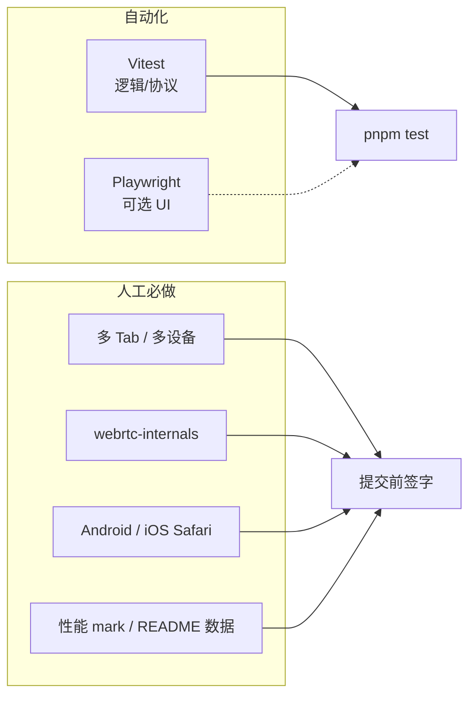

# LocateRoom Lite — 测试说明

> 对照 [验收清单](./ACCEPTANCE.md) 与 [技术设计](./TECHNICAL.md)。说明每项验收由 **Vitest**、**Playwright** 还是 **人工** 覆盖，以及原因。

## 1. 总体策略

本项目以 **人工测试为主**，辅以 **Vitest 单元/逻辑测试**。**不将 Playwright 作为 MVP 必选项**（可后续补充少量冒烟 E2E）。

| 方式 | 角色 | 原因 |
|------|------|------|
| **人工** | 主路径：WebRTC P2P、多浏览器、移动端、性能指标 | 真建连、NAT、权限、fps 难以在 CI 里稳定复现 |
| **Vitest** | 可自动化：纯函数、协议、状态机、GeoJSON 合并 | 仓库已配置 `vitest` + `jsdom`，成本低、跑得快 |
| **Playwright** | 可选：UI 流程、mock 定位后的页面断言 | 不测真 WebRTC 时价值有限；4–6h 内非阻塞 |
| **Chrome MCP** | **不使用** | 不替代 webrtc-internals / 真机；-setup 成本高于收益 |



---

## 2. 验收项 ↔ 测试方式对照表

图例：**V** = Vitest　**P** = Playwright（可选）　**M** = 人工（必做）

### 2.1 功能

| 验收项 | V | P | M | 说明 |
|--------|---|---|---|------|
| 创建房间并生成分享链接 | — | ○ | **●** | 路由跳转、UUID；P 可断言 URL 含 `roomId` |
| 通过链接加入同一房间 | — | ○ | **●** | 依赖信令 + 多上下文；真联调必须 M |
| 在线成员列表 | ○ | ○ | **●** | V：reducer/ store 增删成员；M：4 tab 人数一致 |
| 加入/离开实时通知 | — | ○ | **●** | Toast/事件；M 关 tab 验证 |
| 位置 10 Hz 上报 | **●** | — | **●** | V：`tick` 调度/节流计数；M：10s 采样写 README |
| 地图实时展示 | — | ○ | **●** | MapLibre 与 rAF；M 目视 + fps |
| 位置经 DataChannel P2P | — | — | **●** | M：`chrome://webrtc-internals` + 信令无坐标 |
| 新成员立即看到全员位置 | **●** | — | **●** | V：`snapshot` 合并逻辑；M 第三人入房瞬间见 marker |
| 断网自动恢复 | — | — | **●** | M：飞行模式 / 断网 5s 后恢复 |
| 掉线可感知 | ○ | — | **●** | V：状态机 `connected→offline`；M UI 灰显/列表 |

### 2.2 性能

| 验收项 | V | P | M | 说明 |
|--------|---|---|---|------|
| 4 人房间正常 | — | — | **●** | 4 tab 或 4 设备，跑 2 分钟 |
| 4 人下 10 Hz | ○ | — | **●** | V 可 mock 发送计数；M 实测写 README |
| 渲染 ≥ 50 fps | — | — | **●** | M：Performance 面板或 rAF 计数 |
| 首屏见他人 ≤ 3s | ○ | ○ | **●** | 代码 `performance.mark`；M/P 断言阈值 |
| 中端 Android H5 | — | — | **●** | 真机 + HTTPS |
| iOS Safari H5 | — | — | **●** | 真机定位权限 |

### 2.3 交付物

| 验收项 | V | P | M |
|--------|---|---|---|
| GitHub 仓库 / 部署链接 | — | — | **●** |
| README 架构/性能/AI 说明 | — | — | **●**（审查文档） |

### 2.4 加分项（选做）

| 验收项 | V | P | M |
|--------|---|---|---|
| 语音对讲 / 弱网 / 轨迹 / 移动优化 | ○ | ○ | **●** |

---

## 3. Vitest — 测什么、不测什么

### 3.1 适合覆盖（建议实现后补充）

| 模块 | 示例用例 |
|------|----------|
| `protocol` | `snapshot` / `update` JSON 解析、非法包丢弃 |
| 信令消息 | `join` / `left` / `signal` 类型守卫 |
| 礼貌端 | `peerId` 字典序决定 offerer |
| 成员 store | 加入、离开、离线状态合并 |
| GeoJSON 合并 | 多 peer 坐标合并为 FeatureCollection |
| 10 Hz 调度 | 100ms 间隔内发送次数（mock timer） |

### 3.2 明确不测

- 真实 `RTCPeerConnection` / ICE 连通（无 headless 稳定方案）
- MapLibre WebGL 帧率
- iOS Safari 权限弹窗

### 3.3 命令

```bash
pnpm test          # vitest run
pnpm test --watch  # 开发时监听（若需要可加 script）
```

测试文件建议放在 `src/**/*.test.ts` 或与模块同目录 `*.test.ts`。

---

## 4. Playwright — 可选范围（MVP 不强制）

当前 **未安装** Playwright。若时间允许，仅建议 **1–2 条冒烟**，且 **mock WebRTC / geolocation**，避免 CI  flaky：

| 场景 | 做法 |
|------|------|
| 创建房间 | 打开 `/` → 点击创建 → URL 匹配 `/room/[uuid]` |
| 分享页可打开 | 直接访问 `/room/:id` 不白屏 |
| 首屏 marker（mock） | 注入 fake DataChannel 消息 → 断言 DOM/map 上存在第二个点 |

安装与运行（可选）：

```bash
pnpm add -D @playwright/test
pnpm exec playwright install chromium
pnpm exec playwright test
```

**真 WebRTC 四端联调不用 Playwright**，仍走人工。

---

## 5. 人工测试 — 必做流程

### 5.1 环境

| 项 | 要求 |
|----|------|
| 协议 | 前端 **HTTPS**，信令 **wss** |
| 桌面 | Chrome × 3 隐身窗口（模拟 2–4 人） |
| 移动 | 中端 Android Chrome + iOS Safari |
| 远程手机 | ngrok / Cloudflare Tunnel 暴露预览地址 |

### 5.2 核心用例（提交前至少各 1 次）

1. **双人**：A 创建 → B 链接加入 → 双方地图见 marker → 移动可见更新  
2. **四人**：4 tab 同时在线 2 分钟，列表为 4，无明显卡顿  
3. **新人快照**：第三人加入后 **立即** 见前两人位置（非等数秒）  
4. **离开**：关 B 的 tab → A/C 在数秒内感知 B 离线  
5. **断网恢复**：A 飞行模式 5s → 关闭 → 位置恢复、成员仍正确  
6. **P2P 举证**：`chrome://webrtc-internals` 截图 + 说明信令不传 lat/lng  

### 5.3 性能测量（写入 README）

在应用内或控制台使用 `performance.mark` / `measure`：

| 标记 | 含义 |
|------|------|
| `room:join-start` | 点击加入/打开房间链接 |
| `room:first-remote-location` | 首次收到他人位置并绘制 |
| （可选）`location:tick` | 每 10 次发送打一次点，用于算 Hz |

| 指标 | 人工测法 | 目标 |
|------|----------|------|
| 10 Hz | 10s 内发送 `update` 次数 ÷ 10 | ≈ 10 |
| 50 fps | Performance 录屏拖动地图 10s | ≥ 50 |
| 首屏 | `first-remote-location - join-start` | ≤ 3000 ms |

### 5.4 提交前 5 分钟快测

- [ ] 2 人 5s 内互见  
- [ ] 第 3 人入房立见前人  
- [ ] 关 tab 后他人感知掉线  
- [ ] 地图拖动流畅  
- [ ] 手机 Safari 定位授权 + 见 marker  

与 [验收清单](./ACCEPTANCE.md) 勾选同步。

---

## 6. 场景矩阵（人工签字）

| 场景 | 2 人 | 4 人 | 断网恢复 | 离开感知 |
|------|------|------|----------|----------|
| 桌面 Chrome | □ | □ | □ | □ |
| Android H5 | □ | □ | □ | □ |
| iOS Safari | □ | □ | □ | □ |

---

## 7. 与 CI 的关系（建议）

| 阶段 | 内容 |
|------|------|
| 每次提交 | `pnpm test`（Vitest）+ `pnpm build` |
| 合并 / 发布前 | 人工跑 §5.2 + 填 [验收清单](./ACCEPTANCE.md) |
| 不纳入 CI | 4 人 WebRTC、真机、fps、webrtc-internals |

---

## 7. 性能面板自测

1. 双人进房，打开右下角 **性能监控**（开发环境默认开）。
2. 确认 **位置发送** ≈10Hz、**地图渲染** ≥50fps。
3. 切换 **弱网: on**，观察 Hz≈5 与「弱网降级: 生效」。
4. **导出 JSON** 用于 README 性能数据。

---

## 8. README 测试章节模板（可复制）

```markdown
## 测试

- **自动化**：Vitest 覆盖协议解析、成员状态、10Hz 调度等（`pnpm test`）
- **未自动化**：WebRTC 建连、P2P、移动端、性能 — 见 docs/TESTING.md 人工流程
- **性能实测**：（填表：10 Hz / fps / 首屏 ms / 环境）

### P2P 验证

（webrtc-internals 截图说明 + 信令不传坐标）
```

---

## 9. 相关文档

- [需求说明](./REQUIREMENTS.md)
- [验收清单](./ACCEPTANCE.md)
- [技术设计](./TECHNICAL.md)
- [Agent Skills](./SKILLS.md)
